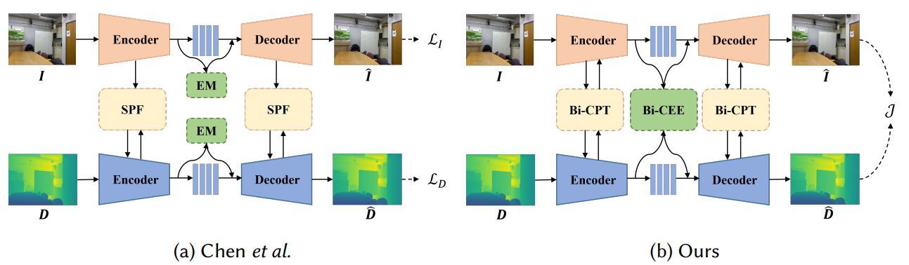

# Bidirectional RGBD Image Compression [TOMM 2024]

* This is the official PyTorch implementation of the paper RGB-D Data Compression via Bi-Directional Cross-Modal Prior Transfer and Enhanced Entropy Modeling (TOMM 2024).

## Architectures

This article is a more detailed extension of our previous work [Chen et al](https://ieeexplore.ieee.org/document/9898073).  , where we explore more cross-modal correlations to make further improvements. The compression scheme comparison is illustrated in Figure 1, and our contributions are summarized as follows: 

• We propose a joint RGB-D compression scheme, evolving our prior unidirectional compression mode into a bidirectional mode. This enhanced approach is comprised of our newly proposed Bi-CPT modules and Bi-CEE model and utilizes a joint training loss to optimize both RGB and depth modality compression simultaneously, which improves rate-distortion performance effectively. 

• We propose a Bi-CPT module designed for seamless integration across various granularity levels. Unlike the SPF module proposed in [Chen et al](https://ieeexplore.ieee.org/document/9898073).  only transfers the RGB features to depth modality, the Bi-CPT module establishes both the RGB-to-depth and depth-to-RGB connections in the encoder and decoder, allowing for the effective exploitation of intermodal correlations.

 • We propose a Bi-CEE model that achieves spatial-channel contextual adaption by partitioning RGB and depth features across both spatial and channel dimensions. This module enables parallel multi-stage processing, leading to accelerated coding and enhanced accuracy of probability estimation for the latent variables.




Fig.1 Comparison between [Chen et al](https://ieeexplore.ieee.org/document/9898073).’s unidirectional RGB-D compression scheme and our proposed joint RGB-D compression scheme.

## Performance


Fig.2 The rate-distortion performance comparison in terms of PSNR and mIoU on the NYUv2 dataset (the first row) and the SUN RGB-D dataset (the second row). From left to right: the PSNR results of the RGB image, the PSNR results of the depth map, and the [semantic segmentation](https://github.com/TUI-NICR/ESANet) results of RGB-D.

## Requirements and dependencies

* Create a virtual environment：

  * ```
    conda create -n TOMM python=3.8
    conda activate TOMM
    ```

* Install compressai：

  * ```
    cd CompressAI
    pip install -U pip && pip install -e .
    ```

* Install torch and torchvision：

  * ```
    wget https://download.pytorch.org/whl/cu101/torch-1.8.1%2Bcu101-cp38-cp38-linux_x86_64.whl
    wget https://download.pytorch.org/whl/cu101/torchvision-0.9.1%2Bcu101-cp38-cp38-linux_x86_64.whl
    pip install torch-1.8.1%2Bcu101-cp38-cp38-linux_x86_64.whl
    pip install torchvision-0.9.1%2Bcu101-cp38-cp38-linux_x86_64.whl
    rm torch-1.8.1%2Bcu101-cp38-cp38-linux_x86_64.whl
    rm torchvision-0.9.1%2Bcu101-cp38-cp38-linux_x86_64.whl
    ```

* Install the other libs：

  * ```
    pip install -r requirements.txt
    ```

## Datasets

* [NYUv2 dataset](https://cs.nyu.edu/~fergus/datasets/nyu_depth_v2.html) [Our Selected NYU5k](https://drive.google.com/file/d/1Ug1M5VQregwsZ-18W6l9A-KDAy-i8ytM/view?usp=sharing)
* [SUN RGBD dataset](https://rgbd.cs.princeton.edu/) [Our Selected SUNRGBD1.5k](https://drive.google.com/file/d/1M0Yhcws_3fuiuICb1c1bUCW393gfF23h/view?usp=sharing)

## Training

```
cd playground
CUDA_VISIBLE_DEVICES=0 python train.py --save  -e 1 -lr 1e-4  -m ELIC_united --channel 4 -q 2_2 --batch-size 4 --dataset /data/chenminghui/nyud/nyu5k  --val_dataset /data/chenminghui/nyud/nyu5k/val
```

## Testing

```
cd playground
CUDA_VISIBLE_DEVICES=0 python test.py  -m ELIC_united --channel 4 -q 2_2 --dataset /data/chenminghui/nyud/nyu5k/nyuv2/test 
```

## Related projects

We also sincerely recommend some other excellent works related to us. 

* [CompressAI](https://github.com/InterDigitalInc/CompressAI/)
* [MLIC/MLIC++](MLIC/MLIC++)
* [Googolxx/STF](Googolxx/STF)

## Citation

Please consider citing our papers if you find the code useful for your research.

**ICIP2022**

```
@INPROCEEDINGS{9898073,
  author={Chen, Minghui and Zhang, Pingping and Chen, Zhuo and Zhang, Yun and Wang, Xu and Kwong, Sam},
  booktitle={2022 IEEE International Conference on Image Processing (ICIP)}, 
  title={End-To-End Depth Map Compression Framework Via Rgb-To-Depth Structure Priors Learning}, 
  year={2022},
  volume={},
  number={},
  pages={3206-3210},
  keywords={Image coding;Codecs;Fuses;Redundancy;Rate-distortion;Feature extraction;Data mining;Depth map compression;cross-modal;feature fusion},
  doi={10.1109/ICIP46576.2022.9898073}}
```

**TOMM2024**

```
@article{
	xxxx
}
```
